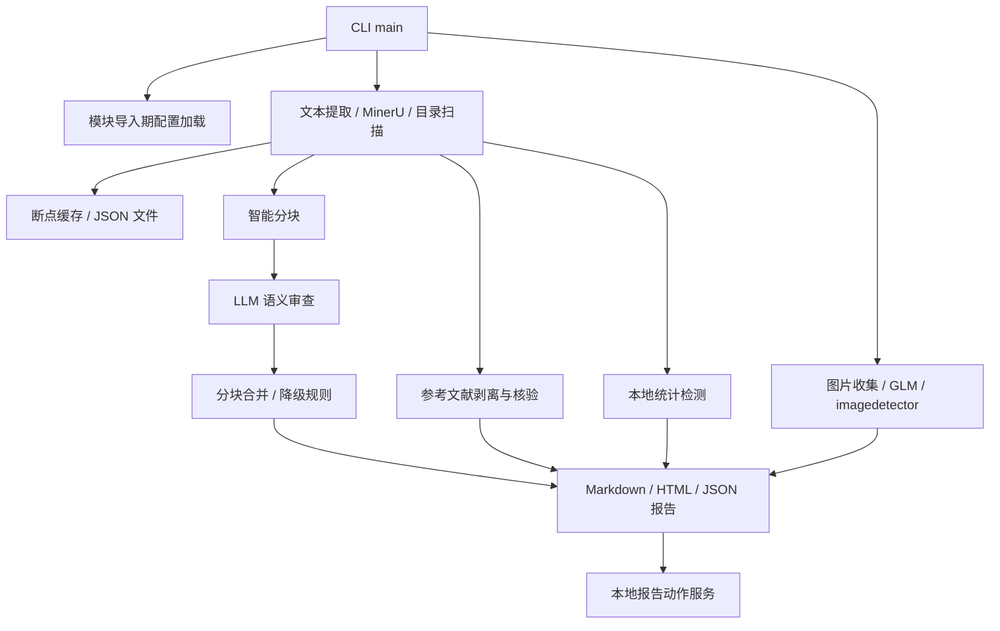
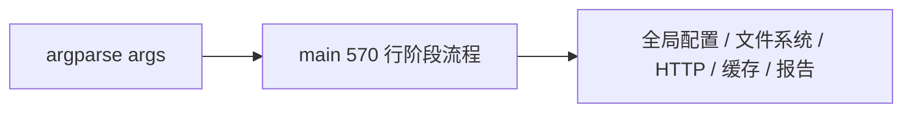
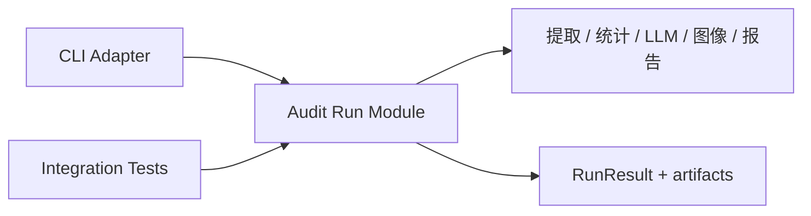
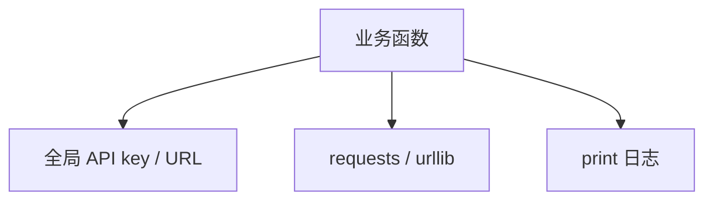
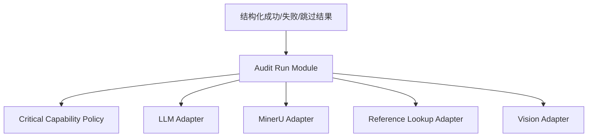
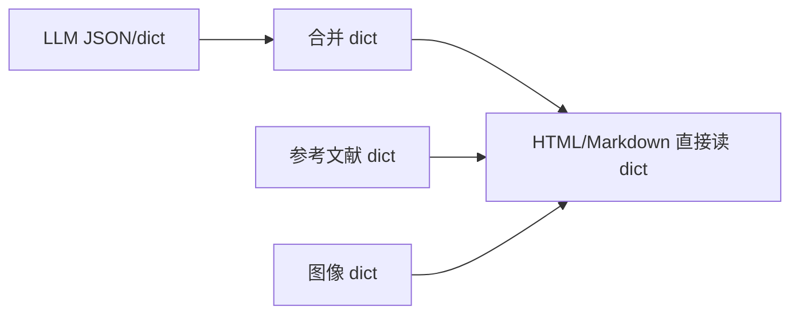
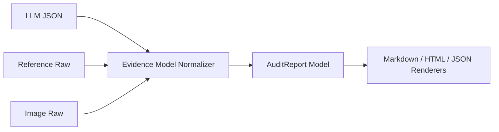
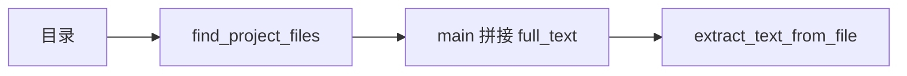

# Paper Audit / Veritas 项目分析报告

生成日期: 2026-05-28

用途: 为后续 plan、grill、重构拆票提供项目级上下文。本文只分析当前仓库事实，不提出最终 Interface 设计。

## 1. 项目目的

从 `README.md` 和当前实现看，项目目标是做一个面向学术论文/论文项目目录的自动审查工具:

- 输入单篇论文或论文项目目录，识别 PDF、Word、Excel、CSV、补充材料、参考文献等材料。
- 结合 MinerU/OCR、本地统计、LLM 语义审查、参考文献在线核验、图像语义理解和 AI 图像检测，输出可复核的 Markdown/HTML/JSON 报告。
- 报告要避免把 OCR/表格提取噪声直接升级为造假结论，并提供证据摘录、复核顺序、PubPeer/期刊信件后续动作。

这个目标本质上要求项目在三个方向上变强:

- **证据可信度**: 不只生成结论，还要能解释证据来源、覆盖率、失败块、外部核验状态。
- **可恢复运行**: MinerU、LLM、参考文献数据库、图像检测都可能慢、失败、限流，工具需要断点续跑和缓存。
- **可维护扩展**: 审查流程已经从单 PDF 扩展到目录级、多外部源、多报告格式，单文件脚本会逐步限制演进。

## 2. 当前项目事实

仓库文件很少:

- `paper_audit.py`: 5668 行，承载配置加载、CLI、MinerU、文本提取、统计、分块、LLM、参考文献、图像检测、报告渲染、动作服务。
- `tests/test_core.py`: 1097 行，覆盖核心行为，包括分块、参考文献、图像缓存、HTML 渲染、LLM 解析、CLI help。
- `README.md`: 260 行，产品说明较完整。
- `pyproject.toml`: 定义 `paper-audit = "paper_audit:main"`，依赖和测试 extra。
- `.gitignore`: 已排除 `config.py`、运行报告、日志、断点缓存等。

验证结果:

- `python -m py_compile paper_audit.py`: 通过。
- `python paper_audit.py --help`: 通过，能输出 CLI 参数。
- `python -m pytest -q`: 未运行成功，当前环境没有安装 `pytest`。

## 3. 当前结构图

当前流程已经有明确产品价值，但 Module 的 Interface 大多还是函数级和全局变量级，深度不足。理解一次运行需要在一个文件中跨越配置、I/O、HTTP、缓存、评分、渲染和 CLI。

### 3.1 证据索引

后续 plan/grill 可以优先从这些代码位置进入:

- `paper_audit.py:220` 附近: 导入期加载 `config.py` / `mykey.py`，并设置全局 LLM/MinerU/GLM 配置。
- `paper_audit.py:268` 附近: 尝试加载 `fraud_patterns.json` 知识库。
- `paper_audit.py:335` 附近: `_http_request()` 作为所有 HTTP 请求的通用实现。
- `paper_audit.py:351` / `paper_audit.py:431`: MinerU URL/文件解析路径。
- `paper_audit.py:815`: `find_project_files()` 目录扫描和文件分类规则。
- `paper_audit.py:942`: `extract_text_from_file()` 多格式文本提取。
- `paper_audit.py:1039`: `smart_chunk_text()` 分块和表格边界处理。
- `paper_audit.py:1155`: `call_llm()` LLM 审查调用。
- `paper_audit.py:1489`: `merge_chunk_reports()` 分块合并、风险重估和 OCR 红旗降级。
- `paper_audit.py:1672`: `audit_references()` 参考文献离线/在线核验。
- `paper_audit.py:2960`: `format_html_report()` HTML 报告主体。
- `paper_audit.py:4172` 之后: 图片收集、GLM 语义理解、imagedetector 调用和图片复核清单。
- `paper_audit.py:5096`: `main()` CLI 参数和完整运行编排。
- `tests/test_core.py`: 当前行为测试入口，覆盖分块、参考文献、图像、报告和 CLI help。

## 4. 主要提升机会

### Candidate A: 把审查运行流程沉淀为深 Module

**Recommendation strength: Strong**

涉及文件:

- `paper_audit.py` 中 `main()`、`setup_run_logging()`、`get_resume_dir()`、`resume_event()`、`normalize_run_meta()`、阶段 1-5 逻辑。

现状问题:

- `main()` 同时负责参数解析、配置覆盖、输入判断、缓存读写、文本提取、参考文献核验、统计、LLM 分块、图像检测、报告写入和浏览器打开。
- 运行流程的 Interface 是 CLI 参数加大量全局变量，测试想覆盖完整运行只能模拟很多外部细节。
- 后续想支持批处理、GUI、本地队列、只跑某阶段、重试失败阶段时，会继续把条件分支压进 `main()`。

深化方向:

- 抽出一个 **Audit Run Module**，它的 Interface 接受 `RunRequest`，返回 `RunResult`。
- CLI 只负责把 argparse 结果转换成 `RunRequest`，报告/服务/测试都通过同一 Interface 调用。
- 缓存、日志和阶段事件保留在实现里，不散落给调用方。

Before:

After:

收益:

- **Locality**: 阶段顺序、失败策略和覆盖率规则集中在一个运行 Module。
- **Leverage**: CLI、测试、后续 UI 或批处理都能复用同一运行 Interface。
- 测试可以围绕运行结果断言，而不是只测零散函数。

### Candidate B: 把外部依赖变成真实 Adapter

**Recommendation strength: Strong**

涉及文件:

- `call_llm()`、`call_llm_messages()`、`mineru_extract_file()`、`mineru_precision_extract_by_url()`、`lookup_crossref_reference()`、`lookup_openalex_reference()`、`lookup_pubmed_reference()`、`call_glm_image_semantics()`、`call_imagedetector()`、`serve_report_actions()`。

现状问题:

- 外部调用直接读全局配置，如 `LLM_API_KEY`、`MINERU_TOKEN`、`GLM_API_KEY`、`MINERU_BASE`。
- `_http_request()` 是通用函数，但不是可替换 Adapter；不同外部源的重试、限流、身份、关键失败策略无法统一表达。
- 单元测试通过 monkeypatch 单个函数绕开网络，但完整流程很难测试外部失败矩阵。
- 本轮 grill 已确认 `imagedetector.com` 是绑定关键服务商；当输入存在可检测图片时，服务失败应阻断完整报告。

深化方向:

- 引入 **External Check Adapter Module**，至少区分 LLM、MinerU、Reference Lookup、Vision Semantic、Image AI Detector。
- 每个 Adapter 的 Interface 返回结构化结果和错误类型，不直接打印、不直接依赖全局变量。
- 增加 **Critical Capability Policy**: preflight、内容条件阻断、完整/范围受限/失败产物分类。

Before:

After:

收益:

- **Locality**: 外部服务的超时、限流、错误归类和关键失败处理集中。
- **Leverage**: 可以为测试提供 fake Adapter，为可选 eval 提供 record/replay Adapter，为未来服务端部署提供不同 Adapter。
- 关键服务失败会落到统一失败诊断报告，而不是散落在各阶段的 print 和 partial report 中。

### Candidate C: 建立审查证据与报告数据模型

**Recommendation strength: Strong**

涉及文件:

- `parse_report()`、`merge_chunk_reports()`、`_downgrade_extraction_red_flags()`、`build_audit_action_items()`、`_report_action_context()`、`format_report()`、`format_html_report()`、`format_reference_audit_*()`、`format_image_audit_*()`。

现状问题:

- 报告对象、检查项、参考文献、图像审查、统计结果都用 dict 传递。字段名由调用约定维护，如 `checks`、`source_text`、`evidence`、`reason`、`detail`、`score_breakdown`、`_partial_warning`。
- LLM JSON 容错、OCR 降级、风险评分、HTML 渲染共用同一批 dict，字段缺失或变形只能靠大量 `.get()`。
- 报告渲染 Module 被迫理解所有上游不完整状态，Interface 过宽。

深化方向:

- 定义 **Evidence Model Module**，包括 `AuditFinding`、`AuditReport`、`ReferenceAudit`、`ImageAudit`、`Coverage`、`RunMeta`。
- LLM 原始响应先进入解析/归一化 Module，再进入合并和渲染。
- 渲染只消费稳定模型，不负责修补上游结构。

Before:

After:

收益:

- **Locality**: 字段兼容、降级、缺省值和安全转义集中。
- **Leverage**: 新报告格式、动作服务、JSON API 都复用同一个模型。
- 更容易写黄金样例测试，验证报告语义稳定。

### Candidate D: 把输入发现和文本提取分开

**Recommendation strength: Worth exploring**

涉及文件:

- `find_project_files()`、`_main_paper_score()`、`extract_text_from_file()`、`extract_pdf_text()`、`mineru_extract()`。

现状问题:

- 文件发现、主论文评分、参考文献文件排除、补充材料分类和实际文本提取混在运行流程里。
- `find_project_files()` 已经有不少领域规则，测试也覆盖了 `reference` 命名 PDF 的误分类问题，说明这个 Module 正在变重要。
- `extract_text_from_file()` 同时做格式分派、MinerU 降级、Word/Excel/CSV 读取和截断策略。

深化方向:

- 抽出 **Input Project Module**，Interface 返回 `InputManifest`: 主论文、补充材料、原始数据、参考文献文件、其他文件、生成产物排除原因。
- 抽出 **Text Extraction Module**，消费 `InputManifest`，返回带来源块的 `ExtractedCorpus`。

Before:

After:

收益:

- **Locality**: 目录分类错误不会散到审查流程。
- **Leverage**: 后续可以显示输入清单、支持 dry-run、调试为什么某文件被纳入或排除。

### Candidate E: 让缓存和断点续跑成为独立 Module

**Recommendation strength: Worth exploring**

涉及文件:

- `_json_load()`、`_json_save()`、`get_resume_dir()`、`resume_event()`、`_text_fingerprint()`、`_allow_llm_cache_read()`、`main()` 中 `stage1_extract.json`、`reference_online_cache.json`、`llm_*`、`image_*_cache.json`。

现状问题:

- 缓存路径、版本、读写、阶段事件散在运行流程里。
- 不同缓存的 key 策略不一致，有些按文本指纹，有些按文件指纹，有些按输入路径和参数。
- 后续如果要清缓存、列出失败阶段、只重跑某阶段、把缓存迁移到 SQLite，目前没有统一 Interface。

深化方向:

- 建立 **Run Workspace Module**，管理产物目录、日志、阶段事件、缓存版本、cache hit/miss、失败状态。
- 运行流程只表达“我要读/写某阶段结果”，不关心文件名和 JSON 原子写细节。

收益:

- **Locality**: 断点续跑语义集中，避免每个阶段重复实现缓存策略。
- **Leverage**: 支持 `--resume-status`、`--rerun-stage`、`--clear-cache-stage` 这类运维能力。

### Candidate F: 拆分报告渲染皮肤和内容逻辑

**Recommendation strength: Worth exploring**

涉及文件:

- `format_html_report()` 约 900 行，包含内容选择、排序、证据表格渲染、CSS、HTML 模板、动作面板。
- `format_report()`、`render_evidence_html()`、`format_image_audit_html()`、`format_reference_audit_html()`。

现状问题:

- HTML 样式和报告语义在一个函数内，视觉调整容易影响报告逻辑。
- README 说输出“Claude风格HTML报告 + Markdown报告 + 原始JSON”，但代码中 HTML 已经包含大量特定交互和本地动作服务上下文。
- 报告可读性是产品核心，应该有独立回归样例。

深化方向:

- 分成 **Report Content Module** 和 **Report Renderer Module**。
- Renderer 内部可继续保持简单字符串模板，但从稳定内容模型读取。
- 增加固定 fixture 的 HTML/Markdown snapshot 或结构断言。

收益:

- **Locality**: 证据排序、风险摘要和视觉布局各自维护。
- **Leverage**: 后续可以加入轻量报告、审稿人版报告、机器 JSON without HTML concerns。

## 5. 产品目标与实现偏差

这些不是指责，而是后续 plan 时需要优先对齐的事实。

### 5.1 README 声称小文件可无 Token 使用 MinerU，但代码要求 Token

README 写到小文件可“无需配置，自动使用内置免Token的Agent API”。当前 `mineru_extract_file()` 在没有 `MINERU_TOKEN` 时直接返回错误。`mineru_extract()` 的 URL 分支也不暴露给 CLI，因为 `main()` 要求输入路径必须存在。

影响:

- 新用户按 README 操作可能无法获得 MinerU OCR 体验。
- 如果这是已废弃能力，README 应更新；如果是目标能力，代码需要补 Agent API Adapter。

### 5.2 README 声称内置欺诈模式知识库，但仓库没有 `fraud_patterns.json`

代码会尝试加载 `fraud_patterns.json`，不存在时只是使用默认规则。README 写“内置12+种”会让用户预期仓库含初始知识库。

影响:

- 产品可信度受影响。
- `--update-patterns` 的输出目标存在，但初始状态不清晰。

### 5.3 旧 README 的隐私友好表述与已确认方向不一致

README 强调隐私友好；本轮 grill 已确认本工具评估的是公开发表文献，不以隐私保护为首要约束。默认方向应改为第三方服务增强优先，imagedetector 是绑定服务商，输入中存在可检测图片时属于关键能力。

影响:

- README 应从“本地/隐私友好优先”改为“公开文献第三方增强审查优先”。
- 外部服务失败时不应生成看似完整的报告，应生成失败诊断报告。
- 见 [ADR-0001](adr/ADR-0001-third-party-first-critical-service-gating.md) 和 [ADR-0003](adr/ADR-0003-adapter-capabilities-and-configuration.md)。

### 5.4 import 有副作用

导入 `paper_audit` 会加载 `config.py`/`mykey.py`、打印配置状态、尝试加载知识库。测试和作为包使用时都会触发。

影响:

- 测试输出和库使用体验不稳定。
- 未来拆 Module 时会阻碍可组合性。

### 5.5 URL 输入路径存在死分支/潜在错误

`mineru_extract()` 看起来支持 URL，但 CLI 要求 `Path(args.pdf_path).exists()`。此外 `mineru_precision_extract_by_url()` 当前签名没有 `output_dir`，但 `mineru_extract()` URL 分支会传入 `output_dir`。

影响:

- 如果计划支持 URL 审查，这条路径需要修复和测试。
- 如果不支持 URL，应删除或明确标注未支持，减少浅 Module。

## 6. 测试覆盖评价

已有测试价值很高，覆盖了以下关键风险:

- 数字提取、统计异常、样本量冲突。
- 智能分块上限和表格边界。
- MinerU structured text 优先级。
- 参考文献解析、在线核验缓存、HTML 渲染。
- 图像语义、imagedetector flow、缓存、优先队列。
- LLM JSON 容错、分块合并、OCR 红旗降级。
- 报告 HTML 中证据表格渲染和动作上下文。
- CLI help 暴露关键参数。

主要缺口:

- 没有完整 `Audit Run` 级测试，无法一次验证从输入目录到产物的端到端行为。
- 外部调用依赖 monkeypatch，缺少统一 Adapter fake 后的失败矩阵测试。
- 报告 HTML 只做片段断言，缺少稳定内容模型或 snapshot 层。
- 缺少 README 承诺与 CLI/代码能力的一致性测试。
- 当前环境没有 `pytest`，无法验证测试套件是否实际绿色。

## 7. 推荐顺序

Top recommendation: 先做 Candidate B + 关键第三方能力/preflight/失败诊断策略，再做 Candidate A。

理由:

- 该工具处理公开发表文献，产品质量主要来自第三方 OCR、LLM、参考文献核验、图像语义和 imagedetector 的完整覆盖。
- 外部 Adapter、preflight 和失败诊断抽出后，`Audit Run Module` 的测试会更容易；否则运行流程一抽出来仍会被网络、配置和全局状态拖住。
- Candidate A 能把后续所有功能增量拉回一个稳定 Interface，是长期维护的关键。

建议的第一批 plan 切片:

1. 加 `RuntimeConfig`，移除导入期配置副作用和 `mykey.py` 自动兼容。
2. 定义关键能力 preflight，真实轻量调用 MinerU、文本 LLM、参考文献核验、图像语义和 imagedetector。
3. 引入 `audit_report.audit.*` / `audit_report.limited.*` / `audit_report.failed.*` 三类产物。
4. 抽出 MinerU、Text LLM、Reference Lookup、Image Semantic、imagedetector 的最小 Adapter Interface，先不大改业务。
5. 围绕 fake Adapter 写一个目录输入到报告产物的端到端测试。
6. 再抽 `Audit Run Module`，把 `main()` 收缩为参数解析和输出状态码。

## 8. Grill 已确认决策

2026-05-28 的 grill 已经确认以下约束。后续 plan 应把这些作为已接受决策，不再回退到旧方向。

- 默认信任承诺: 第三方服务增强优先。目标文献是公开发表文献，隐私保护不是首要约束。
- 关键能力按内容条件阻断完整报告: MinerU、文本 LLM、参考文献在线核验、图像语义分析、imagedetector。
- MinerU 和 imagedetector 绑定服务商；文本语义审查、参考文献在线核验、图像语义分析按能力定义 Adapter。
- 关键服务失败必须生成 `audit_report.failed.*`，而不是默默生成完整报告。
- 默认不允许 LLM 分块部分成功生成完整报告；所有分块必须成功。
- 默认核验全部可解析参考文献，默认检测全部可检测图片。用户主动设置 limit 时只能生成范围受限报告。
- 删除本地 LLM 和本地 OCR 正式审查路径；本地能力只保留轻量诊断。
- 移除 `mykey.py` 自动兼容，改成显式、可校验配置。
- 拆成包目录，但保留 `paper_audit.py` 作为薄 CLI 入口。
- 按可运行切片迁移，每一步保持 CLI 可用。
- 先建立 fake Adapter 端到端测试，再进行大规模移动。
- 使用 run workspace + shared cache 两层设计。
- preflight 做真实轻量服务调用，不跨 run 长期缓存成功结果。
- LLM 使用严格 schema，解析失败是关键失败，不接受 partial parse 进入完整报告。
- 最终风险等级由规则引擎决定，LLM 负责解释和归纳。
- “打假得分”改为“证据风险分”；删除“可疑黑产”等级。
- 风险等级使用: 低风险、中风险、高风险、严重证据冲突。
- 报告不得直接定性“确认造假/确认学术不端/作者造假”。
- 引入 prompt/schema/risk rule/adapter 版本，并进入 cache key 和报告。
- 引入评估集: 合成样例进入默认测试，真实公开论文进入可选 eval；默认 replay，手动 record。

对应 ADR:

- [ADR-0001: 第三方服务优先与关键服务阻断策略](adr/ADR-0001-third-party-first-critical-service-gating.md)
- [ADR-0002: 删除本地 LLM/OCR 正式审查路径](adr/ADR-0002-remove-local-llm-and-ocr-formal-paths.md)
- [ADR-0003: 按审查能力定义 Adapter，部分服务商绑定](adr/ADR-0003-adapter-capabilities-and-configuration.md)
- [ADR-0004: 规则定级、LLM 解释、版本化缓存与评估集](adr/ADR-0004-risk-rules-versioned-cache-and-evaluation.md)

## 9. 完成定义建议

如果要把这次分析转成执行计划，建议用以下完成定义:

- README 承诺、CLI help、默认第三方服务行为一致。
- 关键服务 preflight 失败会生成 `audit_report.failed.md/json`，必要时生成 HTML，不生成完整报告。
- 有一个端到端测试覆盖: 输入一个包含 PDF/CSV/参考文献文本/图片的假目录，使用 fake Adapter，产出完整报告。
- 另有失败测试覆盖: LLM 分块失败、参考文献外部源全失败、输入含图片且 imagedetector 失败。
- 用户显式设置参考文献或图片 limit 时，产物命名为 `audit_report.limited.*`，首页明确覆盖范围受限。
- `main()` 不再包含阶段实现，只编排 `RunRequest -> RunResult`。
- 报告数据模型有稳定字段，HTML/Markdown Renderer 不直接依赖上游随意 dict。
- 报告记录 prompt/schema/risk rule/adapter 版本。
- 用户可见措辞使用“证据风险分”，不再使用“打假得分”。
